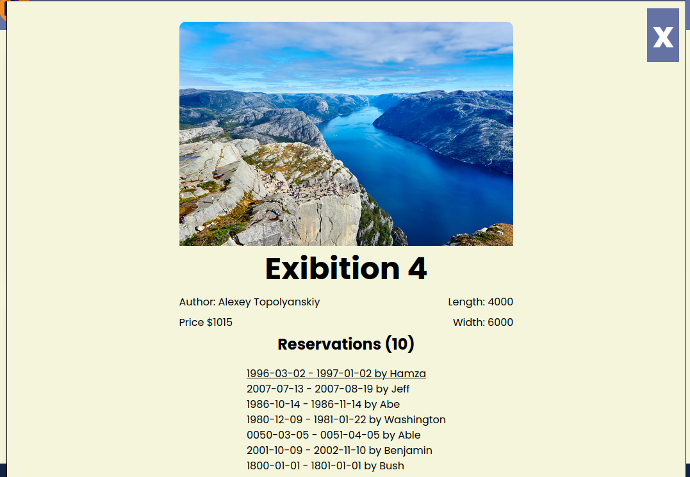
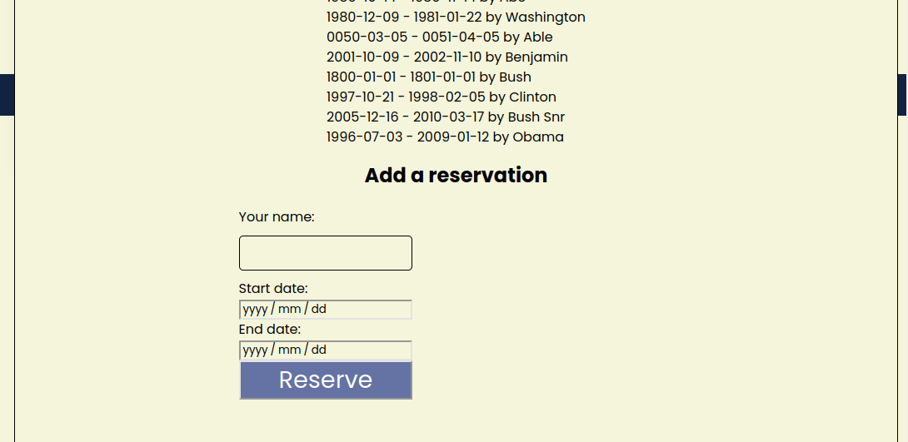
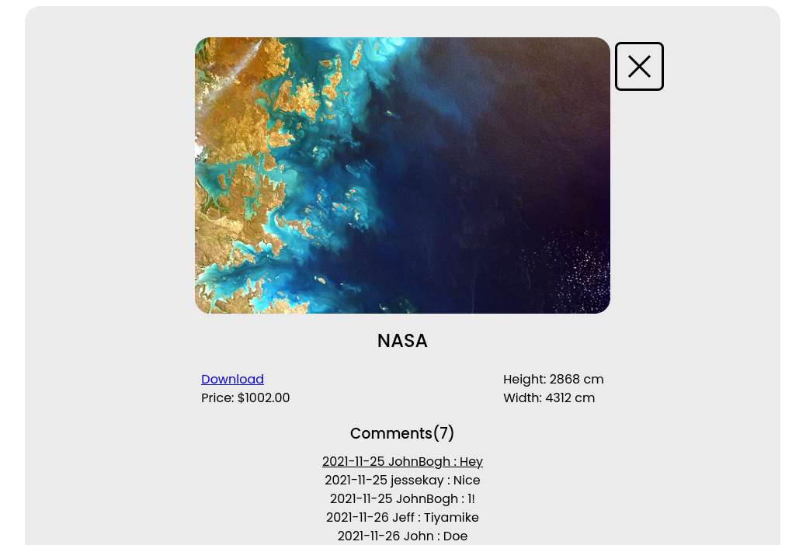
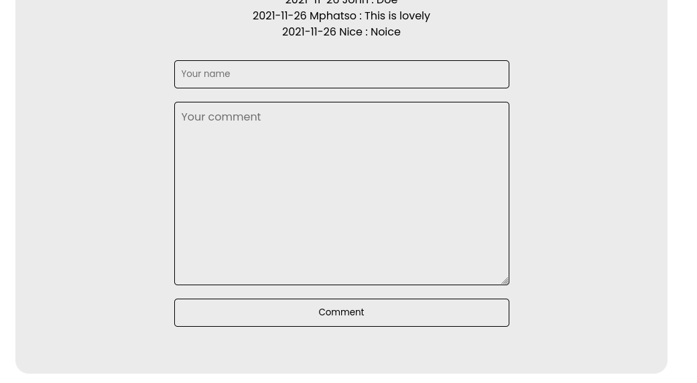

# API-Webapp

This project is about an exhibition app used to display, comment on and reserve art. The page was built using JavaScript and bundled with Webpack and uses API calls. The webapp has 3 user interfaces:
  - A home page showing a list of items that you can "like".
    * Made by: [Molnar Emese](https://github.com/Mesi21)
  - A popup window with more data about an item that you can use to leave a comment.
    * Made by: [Jeff Kayombo](https://github.com/JEFFKAY16)
  - A popup window with more data about an item that you can use to make a reservation.
    * Made by: [Hamza Tarar](https://github.com/Lockless404)








## Built With

* JavaScript
* Webpack
* HTML
* CSS

## Tested With

* Jest

## Aditional Resources

* Kanban Board
* Involvment API
* [Lorem Picsum](https://picsum.photos) 
* Linters: Webhint, Lighthouse, StyleLint, ESLint

## Live Demo

[Live Demo Link](https://cocky-shockley-f14242.netlify.app/)


## Getting Started

To get a local copy up and running follow the next steps:
> Clone the repo to you local machine.
```bash
git clone "https://github.com/Lockless404/api-Webapp.git"
run `npm install`
run `npm start` to start the server
```

## Authors

👤 **Molnar Emese**
 
  - GitHub: [Mesi21](https://github.com/Mesi21)
  - Twitter: [Twitter](https://twitter.com/buksimesi21) 
  - LinkedIn: [LinkedIn](https://www.linkedin.com/in/emesemesimolnar/)

👤 **Hamza Tarar**

  - GitHub: [@Lockless404](https://github.com/Lockless404)
  - Twitter: [@hamza_tarar10](https://twitter.com/hamza_tarar10)
  - LinkedIn: [Hamza Tarar](https://www.linkedin.com/in/hamza-tarar-639685216/)

👤 **Jeff Kayombo**

  - GitHub: [@JEFFKAY16](https://github.com/JEFFKAY16)
  - Twitter: [@JEFF_KAYOMBO](https://twitter.com/jeff_kayombo)
  - LinkedIn: [JEFF KAYOMBO](https://www.linkedin.com/in/jeff-kayombo-aa9758174/)

## 🤝 Contributing

All contributions, issues and feature requests are welcome!

1. Fork it (https://github.com/Lockless404/api-Webapp.git)
2. Create your working branch (git checkout -b [choose-a-name])
3. Commit your changes (git commit -am 'what this commit will fix/add/improve')
4. Push to the branch (git push origin [chosen-name])
5. Create a new Pull Request

Feel free to check the [issues page](../../issues/).

## Show your support

Give a ⭐️ if you like this project!

## :wave: Acknowledgments

* Collaborators
* Morning session team
* Standup team

## 📝 License

This project is [MIT](./MIT.md) licensed.
